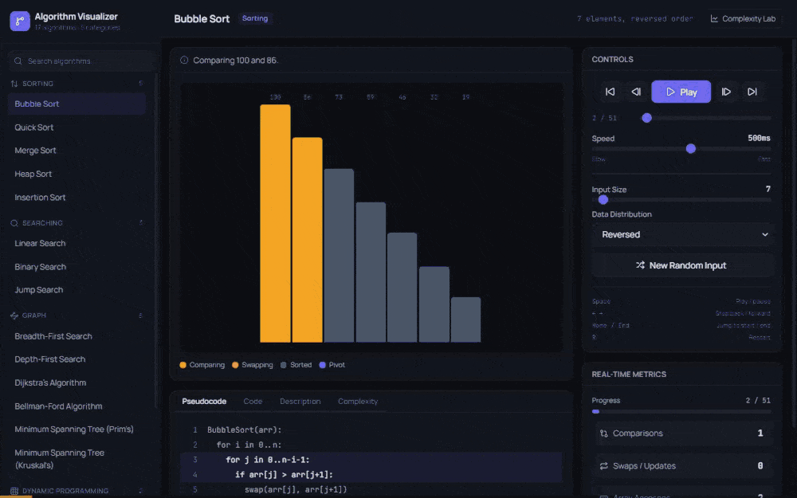

# Algorithm Visualization Tool

An interactive platform for stepping through algorithm execution one operation at
a time — and then **measuring** those algorithms to check the complexity claims
the app itself makes.

**[▶ Live demo](https://algorithm-visualizer-xi-seven.vercel.app)** ·
[Complexity Lab](https://algorithm-visualizer-xi-seven.vercel.app/complexity) ·
[example shared run](https://algorithm-visualizer-xi-seven.vercel.app/?algo=heap-sort&size=28&dist=reversed)

<!--
  Record a short GIF of a sort running, then the Complexity Lab, and drop it here:
  
-->

[](https://github.com/Barath-Grama/algorithm-visualizer/actions/workflows/ci.yml)

17 algorithms across 5 categories, each implemented as a generator that yields one
observable operation at a time. 261 tests. Built with React 19 + TypeScript
(strict), Vite, Tailwind CSS v4, React Query and React Router.

## Getting started

```bash
npm install
npm run dev       # dev server on http://localhost:5173
npm test          # 261 tests
npm run build     # typecheck + production build
```

Requires Node.js 18+.

## What's in it

| Category | Algorithms |
|---|---|
| Sorting | Bubble, Quick (median-of-three), Merge, Heap, Insertion |
| Searching | Linear, Binary, Jump |
| Graph | BFS, DFS, Dijkstra, Bellman-Ford, Prim's MST, Kruskal's MST |
| Dynamic Programming | 0/1 Knapsack, Fibonacci (naive **and** memoized) |
| Backtracking | N-Queens |

### The Complexity Lab

The headline feature. It sweeps each size-parameterised algorithm across a range
of input sizes, fits the measured operation counts against candidate growth
curves by least squares, and reports the best fit beside the Big-O the registry
declares. **All eight agree:**

| Algorithm | Declared | Measured best fit | R² |
|---|---|---|---|
| Bubble Sort | O(n²) | O(n²) | 1.000 |
| Insertion Sort | O(n²) | O(n²) | 1.000 |
| Quick Sort | O(n log n) | O(n log n) | 0.993 |
| Merge Sort | O(n log n) | O(n log n) | 1.000 |
| Heap Sort | O(n log n) | O(n log n) | 0.999 |
| Linear Search | O(n) | O(n) | 1.000 |
| Binary Search | O(log n) | O(log n) | 0.959 |
| Jump Search | O(√n) | O(√n) | 0.987 |

This is also asserted in the test suite, so a mislabelled complexity or an
implementation that silently regresses to a worse class fails CI.

Graph, DP and backtracking algorithms are deliberately excluded: they run on
fixed sample inputs, so there is no single `n` to sweep against.

## Architecture

Every algorithm is a generator (`function*`) yielding one `AlgorithmStep` per
observable operation. Two consumers drain the same generators:

- **The player** materialises steps into an array so the UI can scrub freely in
  both directions.
- **The measurement path** keeps only the running metrics. Since nothing will be
  rendered, snapshotters skip building the visualization payload entirely —
  otherwise every step copies the array and its state buffer, which is
  `O(steps × n)` garbage for counts nobody looks at.

The algorithms stay the single source of truth for both.

Sweeps run in a **Web Worker**, so a 112-run measurement (~3.5s) never blocks the
page.

```
src/
  algorithms/        # step generators + shared helpers
  components/
    charts/          # ComplexityChart (hand-rolled SVG)
    visualizers/     # array, graph, DP table, recursion tree, chessboard
    layout/ controls/ panels/ ui/
  hooks/
    useAlgorithmPlayer     # play/pause/step/scrub state machine
    useComplexitySweep     # drives the measurement worker
    usePlayerShortcuts     # keyboard transport
  lib/
    algorithmRegistry      # metadata, pseudocode, code, complexity, line maps
    runAlgorithm           # materialises steps for the visualiser
    measureAlgorithm       # drains generators for counts only
    curveFit               # least-squares growth-curve fitting
    urlState               # query-string serialisation
```

### Design notes

- **Input is seeded, not `Math.random`.** A run is reproducible, and only "New
  Random Input" changes the data — adjusting an unrelated control never re-rolls
  the array you were watching.
- **Runs are URL-addressable.** Algorithm, options and seed live in the query
  string, so a specific run can be linked and the Back button undoes changes.
- **Step highlighting is mapped, not shared.** Steps report *pseudocode* line
  numbers; each algorithm carries a `codeLineMap` translating those to the real
  implementation, so both tabs highlight the same statement instead of applying
  one set of indices to two texts of different lengths.
- **Chart colour follows the entity.** Series keep their colour and marker shape
  as others are toggled. The eight-slot palette clears the adjacent-pair CVD gate
  against this surface but not the all-pairs gate, so identity is additionally
  carried by marker shape, direct end-labels and a raw-data table.
- **Keyboard transport.** Space, arrows, Home/End, R — ignored while typing.

## Testing

261 tests. The strongest are **property-based cross-checks between independent
implementations**, which fail if either side regresses:

- Dijkstra and Bellman-Ford must agree on distances from all 7 source nodes
- Prim and Kruskal must find the same total MST weight
- Knapsack's DP table is checked against a brute-force subset search
- N-Queens solutions are verified for column and diagonal conflicts
- Measured growth curves must match declared complexity

The suite was **validated by mutation**: flipping a sort comparison, restoring
the jump-search loop bound, reverting the player's reset key, and corrupting a
`codeLineMap` entry each turn it red. A fifth mutation initially survived — the
line-map test only ran default options, so searches always found their target and
the miss-path lines were never exercised. It now sweeps 17 option variants.

## Engineering notes

Three bugs worth writing down, because the diagnosis was more interesting than
the fix:

**Bars rendered at zero height.** The bar track used `align-items: flex-end`, so
each column's height was content-based rather than stretched. A percentage height
against an auto-height parent resolves to `auto` — every bar computed to `0px`,
and all eight array algorithms rendered an empty canvas. Fixed by giving the bar
its own `flex-1` track so the percentage resolves against the plot area alone.

**Jump search looped forever.** The loop was bounded on `curr < n`, but `curr`
pins at `n - 1` and can no longer advance, so any target above the array maximum
spun until the 6000-step cap masked it. The guard that was meant to catch this
was unreachable. Bounded on `curr < n - 1` instead.

**A render-phase reset froze the whole app.** Resetting the playhead during
render (rather than in an effect, which flashes a stale frame) is the right
pattern, but it compared the `steps` array by identity — and `useMemo`
re-allocates that array on every render-phase retry, so the reset re-fired
forever and *no* state update could commit. Clicking anything did nothing. Keying
the reset on a stable run id makes it settle in one retry.

A fourth, found while building the chart: **Tailwind v4 prunes `@theme`
variables it cannot see referenced literally.** The series colours are addressed
as `` var(`--series-${slot}`) `` at runtime, so that string appears in no source
file and all eight were dropped from the build — every mark rendered black. Chart
tokens now live in a plain `:root` block.

## Scope

Intentionally left out: a backend (this is a client-side teaching tool), and
force-directed graph layout (a fixed circular layout is clearer at 7 nodes, and
the Web Worker budget went to the Complexity Lab instead).
